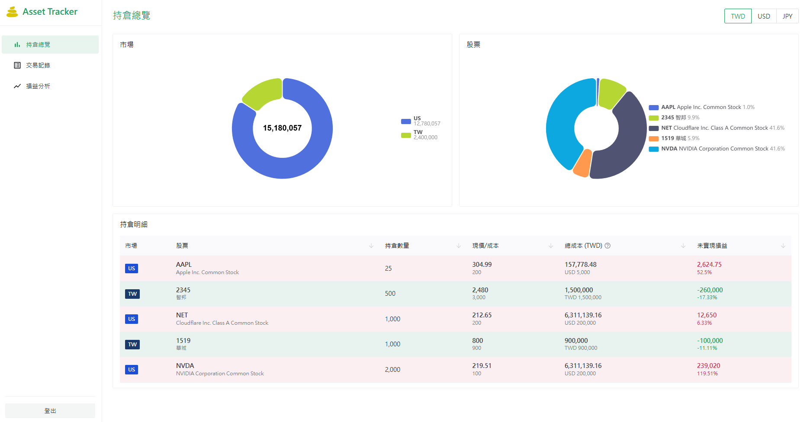
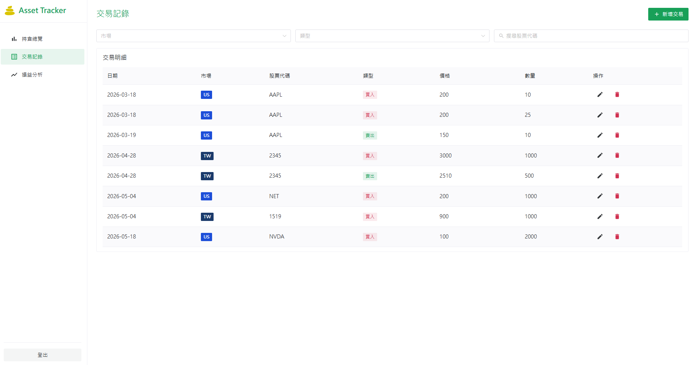
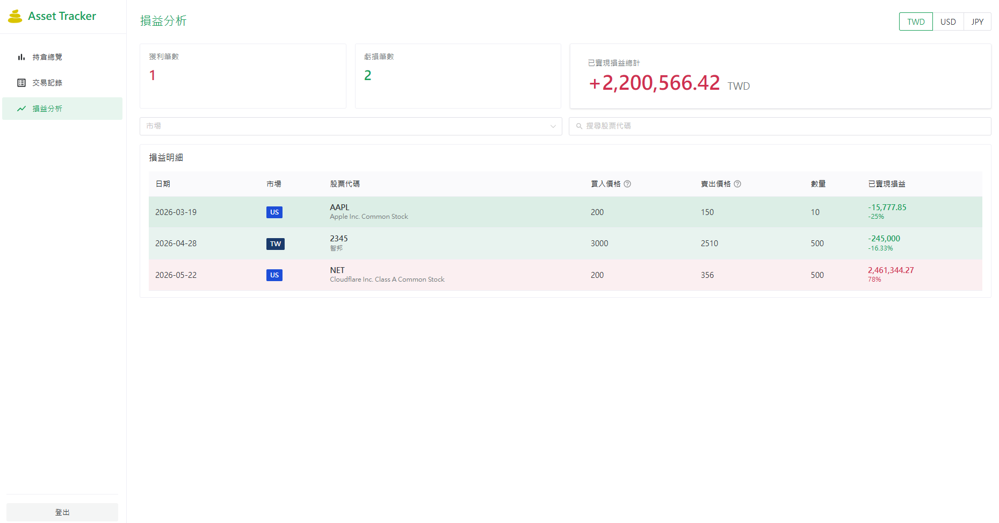
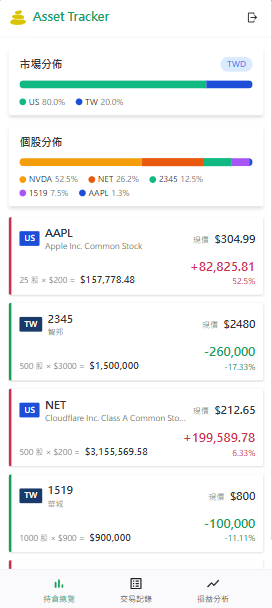
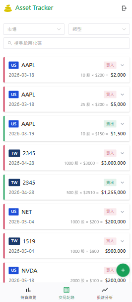
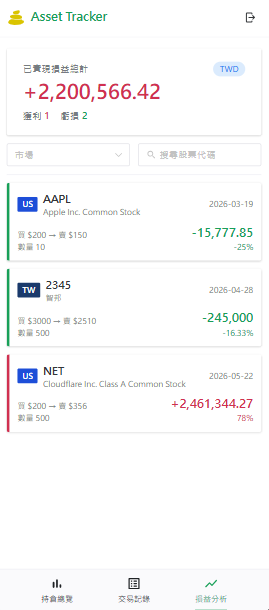

# Asset Tracker 資產追蹤工具

一個全端的股票資產管理工具：記錄買賣交易、自動算出持倉成本與已實現損益。

---

## Demo

**線上版本：[https://yellow-bay-0f031bf00.7.azurestaticapps.net/](https://yellow-bay-0f031bf00.7.azurestaticapps.net/)**

> ⚠️ 後端與資料庫採無伺服器（serverless）部署，閒置後會休眠，首次開啟請稍候冷啟動。

以下是執行畫面。

### 桌機版

**持倉總覽** — 市場分佈、個股佔比、未實現損益



**交易記錄** — 跨市場買賣明細，可依市場、類型、股票代碼篩選



**損益分析** — FIFO 配對的每筆已實現損益



### 手機版

視窗變窄時自動切換為卡片佈局，導覽從側邊欄收進底部。

<table>
  <tr>
    <td></td>
    <td></td>
    <td></td>
  </tr>
</table>

---

## 功能一覽

| 模組           | 內容                                                    |
| -------------- | ------------------------------------------------------- |
| **帳號**       | 註冊、登入、登出;未登入會被擋在 modal 外                |
| **交易紀錄**   | 新增、編輯、刪除買賣交易;可依市場、股票代碼、買賣別篩選 |
| **持倉總覽**   | 自動算出每支股票的持有數量與平均成本                    |
| **損益分析**   | 用 FIFO 配對每筆賣出對應的買入成本，算出已實現損益      |
| **多市場支援** | 台股、美股、日股                                        |
| **多幣別**     | 串接匯率 API，未來可換算回主要幣別                      |
| **手機版**     | 三頁皆有 RWD，視窗變窄會自動切換成卡片佈局              |

---

## 技術棧

**後端**

- .NET 10 Web API
- Entity Framework Core 10 + SQL Server
- JWT 認證、BCrypt 密碼雜湊
- xUnit 單元測試

**前端**

- Vue 3 + TypeScript + Vite
- Naive UI(元件庫)+ Tailwind CSS(樣式)
- Pinia(狀態管理)、Vue Router

**外部整合**

- FinMind API — 歷史股價
- ExchangeRate API — 匯率

---

## 一些設計決策

- **FIFO 計算** — 持倉成本和損益都用先進先出法，更貼近實際數字
- **核心計算寫成 pure function** — `PositionCalculator` 不依賴 DB 或 Service，方便測試也方便理解
- **Result\<T\> 模式取代 exception** — 業務錯誤用 Result 回傳，不用 throw，前端處理更一致
- **軟刪除** — 所有資料表都用 `DeletedAt` 標記，搭配 EF Core 全域查詢過濾自動排除
- **DTO 防腐層** — 第三方 API 結構(FinMind)放 `DTOs/FinMind/`，自己對前端的合約放 `DTOs/Stock/`，未來換 API 來源不會影響前端

---

## 本機啟動

需要:.NET 10 SDK、Node.js 20+、SQL Server(或 LocalDB)

```bash
# 後端
cd Backend/AssetTracker
dotnet ef database update --project ../Project.Data
dotnet run

# 前端
cd Frontend/asset-tracker
npm install
npm run dev

# 測試
cd Backend
dotnet test
```

---

## 專案結構

```
Project/
├── Backend/         # .NET 10 解決方案(API、Tests、Data、Shared)
├── Frontend/        # Vue 3 前端
└── BrunoAPITool/    # Bruno API 測試集合
```

---

_Built by Enzo — 2026_
